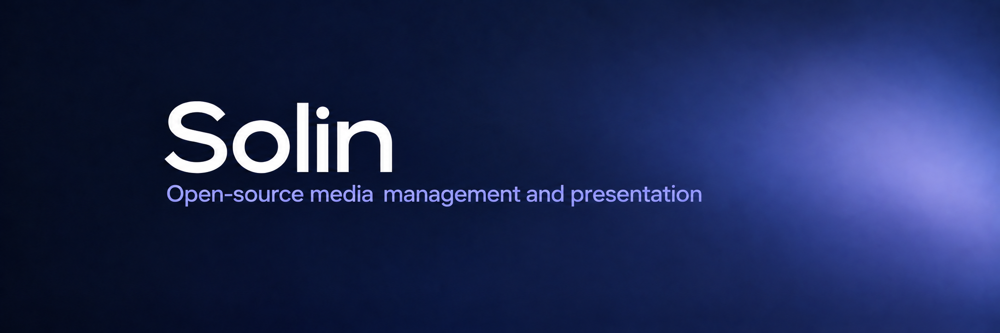

  

  <a href="https://solinav.vercel.app/">Website</a> ·
  <a href="#download">Download</a> ·
  <a href="https://solinav.vercel.app/guide/">User guide</a> ·
  <a href="#for-contributors">Contribute</a>

# Solin

Solin is a free, open-source desktop application for managing audio, video, and
visual presentation. It brings meeting preparation,
JW.org media, playlists, projection, and live scenes into one workspace on
Windows, macOS, and Linux.

## Download

  
  
  

The buttons open the **latest stable release**. Choose the asset for your system:

| Platform | Download | Requirements |
| --- | --- | --- |
| Windows | `Solin-<version>-windows-x86_64.exe` | Windows 10 version 1809 or newer; 64-bit Intel/AMD |
| macOS · Apple Silicon | `Solin-<version>-macos-arm64.dmg` | macOS 13 or newer; Apple M-series |
| macOS · Intel | `Solin-<version>-macos-x86_64.dmg` | macOS 13 or newer; Intel |
| Linux | `Solin-<version>-linux-x86_64.AppImage` | 64-bit Intel/AMD; Ubuntu 24.04 is the reference platform |

See the [installation guide](docs/installation.md) for installation
steps. For beta versions and release notes, browse
[all releases](https://github.com/Solin-Software/Solin/releases).

## Features

| Workflow | What you can do |
| --- | --- |
| Prepare | Browse midweek and weekend meeting media, songs, Original Songs, and other JW.org videos. Organize local files into reusable playlists. |
| Present | Play audio, videos, and images; import documents and presentations as static pages; control playback while projecting to a separate display. |
| Compose | Combine cameras, network video feeds, media, and text in scenes. Preview them, switch with transitions, and record. |
| Coordinate | Use meeting timers and separate profiles. Integrate with OBS and Zoom for setups that need them. |
| Collaborate | Link a shared folder, keep a local cache, and exchange playlist archives. Receive files from a phone over Wi-Fi. |
| Control remotely | Browse meetings and playlists and control playback from a phone, tablet, or another computer on your local network. |

Office document conversion requires LibreOffice. Linked folders use your
existing folder-sync service. Camera and meeting-app integrations depend on
your operating system and setup; test them before the meeting.

## Help and user guides

| Resource | What you will find |
| --- | --- |
| [Installation guide](docs/installation.md) | Install Solin and resolve first-launch problems |
| [User guide](https://solinav.vercel.app/guide/) | Setup and everyday use |
| [FAQ](https://solinav.vercel.app/faq/) | Answers to common questions |
| [About Solin](https://solinav.vercel.app/about/) | The project and its purpose |
| [Releases](https://github.com/Solin-Software/Solin/releases) | Published versions and their changes |

Start with installation, then follow the user guide to configure Solin and
prepare your meeting. Downloaded and local media can be prepared for offline
use; browsing JW.org, downloading new media, and checking for updates require
an Internet connection.

To report a problem or suggest an improvement, check
[existing issues](https://github.com/Solin-Software/Solin/issues?q=is%3Aissue),
then [open an issue](https://github.com/Solin-Software/Solin/issues/new/choose).
The forms help you include the details needed to investigate a bug or discuss
a suggestion. Remove private information from logs and screenshots before
sharing them.

## For contributors

Documentation improvements, translations, bug fixes, and focused pull requests
are welcome. Start with [CONTRIBUTING.md](CONTRIBUTING.md) for environment setup,
running from source, validation, and the review workflow.

| Technical reference | Scope |
| --- | --- |
| [Building and platform requirements](docs/building.md) | Native dependencies, integration support, and packaging |
| [Remote-control architecture](docs/remote-control.md) | Device trust, security, and the service contract |
| [Linked-folder synchronization](docs/linked-folder-sync.md) | Shared-state protocol, conflict handling, and migration |
| [Translations](docs/translations.md) | Catalogs and translation tooling |
| [Development tools](docs/development-tools.md) | Optional repository utilities |
| [Versioning and releases](docs/releases.md) | Release preparation and publication |
| [Source release notes](docs/release-notes/README.md) | Versioned change records |
| [Architecture decisions](docs/adr/README.md) | Design rationale and accepted decisions |
| [Licensing](docs/licensing.md) | Dependency notices and distribution requirements |

## License

Solin is licensed under the **GNU General Public License, version 3 or, at your
option, any later version** (`GPL-3.0-or-later`). See [LICENSE](LICENSE) for the
official license text and [NOTICE](NOTICE) for the application notice.

Third-party components and content retain their respective licenses and terms.
See the [licensing guide](docs/licensing.md) for dependency notices and
distribution requirements.
