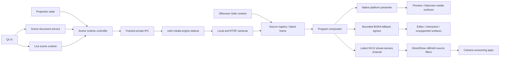

# Native scenes and virtual camera implementation plan

This is the historical implementation plan for the C++ scene engine and its
QtMultimedia playback integration. The default backend now uses a supervised
libobs sidecar for playback and composition, including recording and audio.
Checked items below describe the native implementation at the time of this
plan; they do not qualify the libobs backend or its standalone delivery.
See [Building and platform requirements](building.md) for current requirements.

## Purpose

This document records the architecture, implemented scope, and remaining release work for
Solin's own scene engine. It covers scene editing, camera management, PTZ presets,
media-window composition, and the Solin virtual camera while keeping the existing OBS
WebSocket integration intact and independent. Checked phase items describe the current
implementation; unchecked items remain intentionally unavailable or are release gates.

Solin Scenes is a bounded video graph for Solin content, cameras, composed scenes,
media-window mirroring, and virtual-camera output. Recording, streaming, audio mixing, and
third-party plugins are outside this engine's scope.

## Architecture

The implementation uses:

- Python/PySide6 as the source of truth for persisted configuration, editing, automation,
  PTZ orchestration, and user-facing state.
- A supervised C++20 sidecar for frame acquisition, GPU composition, output windows, and
  virtual-camera production.
- GStreamer through its native C API as the media substrate for camera/RTSP acquisition,
  decode, caps negotiation, hardware acceleration, and queue primitives.
- Direct3D 11 on Windows for GPU memory, composition, presentation, and shared textures.
- DirectShow for per-user publication to x86 and x64 camera consumers on Windows x64.

GStreamer is an implementation dependency, not the owner of the product model. Scene IDs,
layer semantics, output assignments, transitions, automation, persistence, and recovery
remain Solin contracts.

## Product behavior

### Scene editing

- Each global Solin profile owns one shared camera/PTZ resource catalog and one or more
  **scene profiles**. A scene profile owns its scenes, layers, default/media roles, output
  defaults, and automation mappings. Cameras, protected credential references, and PTZ
  presets are shared between the scene profiles in that Solin profile.
- A scene may contain Solin content, local cameras, RTSP cameras, solid colors, and an
  acyclic reference to another scene. Images and video projected by Solin use the same
  Solin-content source; Scenes does not maintain a separate imported-media library.
- Layers support normalized bounds, crop, fit, opacity, visibility, locking, mirroring, and
  rotation. Border and corner-radius values are modeled but require the pending exact shader
  path before they become an advertised rendering capability.
- Scene configuration is immutable in memory and transactionally persisted with optimistic
  revisions, undo/redo, strict schema validation, and explicit recovery.
- Drag/resize editing uses one draft and one history entry per gesture, not one disk write per
  mouse event.

### Scene-profile contract and approved editor

`SceneCollection` is the internal entity; **Scene profile** is the only user-facing name.
Each general Solin profile owns an ordered catalog with immutable IDs and one active Scene
profile. Every collection has its own scene document, backup, optimistic revision, scenes,
instantiated sources, transforms, default/media roles, and entry actions. Camera connections,
protected credential references, and PTZ presets belong to the shared resource catalog of the
general Solin profile and are resolved by stable camera ID when a collection is hydrated.

The first fresh collection is `Profile 1`. It contains only the visible `Camera` default scene
and `Content` media scene; the technical no-signal source remains internal. Existing
`scenes.json` data migrates intact and idempotently into `Profile 1`. Authored document,
resource, and profile-catalog mutations are persisted before UI publication. High-frequency
live selection state is instead serialized and latest-state coalesced on a dedicated writer,
then flushed before profile switching and shutdown. Switching clears editor history and, while
the virtual camera is off, loads and validates the destination, cancels pending Takes/PTZ,
hydrates the engine, and publishes the new active collection only after a current ACK. Timeout,
rejection, or a stale ACK preserves the previous collection. Creation, switching, and deletion
are blocked while the virtual camera is on; rename remains available. The last collection
cannot be deleted.

The approved wide layout has one compact header with the Scene-profile selector, subtitle,
Undo/Redo, and `Output`; below it are three cards: uniform scene rows on the left, a dominant
16:9 canvas in the center, and the selected scene's source stack on the right. Sources expose
only name, visibility, and lock inline. Transform, fit, precise editing, and contextual PTZ live
in the right-click menu. There is no global source manager, permanent numeric geometry card,
global PTZ button, or healthy-engine badge. At narrower widths Sources becomes a drawer; the
smallest layout navigates between panels rather than shrinking the canvas below usability.
The existing theme tokens, not mockup colors, are the visual source of truth.

Camera resources are collected conservatively. A camera, its presets, and its protected
credential reference remain while any active document, inactive Scene profile, recovery
backup, Undo stack, or Redo stack can restore that camera. Credential deletion is queued in
the shared resource catalog and retried after restart if the operating-system vault is
temporarily unavailable.

Contextual PTZ uses one latest-wins lane per camera. Press starts continuous movement, short
press produces a nudge, and release, popup deactivation, profile switching, or shutdown sends
Stop. A dead-man timer independently stops a camera if the UI disappears. ONVIF, VISCA IP,
and VISCA serial implement pan/tilt, zoom, Stop, recall, and remote preset storage through the
same bounded executor.

### One Program, multiple destinations

Solin exposes one live composition named **Program**. The virtual camera is its primary
destination. Media windows can optionally mirror that same Program; they do not select or
automate a second scene. This removes the ambiguous `Media windows: Auto/Take/Output`
controls and guarantees that an in-room display and a call see the same composition when
mirroring is enabled.

| Destination | Initial format | Behavior |
| --- | --- | --- |
| Virtual camera | 1920×1080, 30 fps, NV12/BT.709/limited | Publishes Program to camera applications |
| Media-window mirror | 1920×1080, 30 fps, D3D11-backed on Windows | Opt-in direct presentation of the Program render branch; bounded BGRA fallback |
| Editor Preview | 1920×1080, BGRA/sRGB/full | Non-live selected-scene preview through the bounded fallback |

Program has one base scene, a default-scene role, a media-scene role, and an automatic-media
toggle. Automation is available only when the two roles exist and refer to different scenes.
While projected content is active, automation selects the media scene; when projection stops,
it restores the previous Program base scene, or the configured default when previous-scene
memory is disabled. The toolbar exposes that return target while the automatic media scene is
live, and right-clicking another scene overrides the return without taking it immediately.
Scene-editor Takes of a composition containing projected content retain the return base;
a Take without projected content makes the selected scene the new base and suspends
automatic media for that presentation session. The next session resumes automatically.
Editing history never rewinds Program or destination-enabled state.

The Solin Scenes control panel routes the monitor and virtual camera independently.
During automatic media, a left click immediately selects the live scene for that output.
A composition containing projected content retains the session's return base; a scene
without projected content stays selected after the presentation ends. Selecting a content
composition again restores the saved return base. While showing a content composition,
a right click changes only that output's return base and briefly flashes green after
acceptance. The popup and docked panel share this behavior; ordinary active buttons keep
static colors. A new presentation
session enters the automatic media scene again.

Each Scene profile owns one default Program transition and optional per-scene overrides.
New Scene profiles default to Dissolve at 350 ms; migrated profiles preserve their persisted
Cut or legacy fade setting, with the legacy technical `fade` value interpreted as Dissolve.
Cut is immediate, Dissolve cross-blends both scenes, and Fade passes through an opaque black
frame. The transition applies to manual Take and automatic media entry/return, but never to
the editor Preview. Changing only this policy is a persisted editor mutation and does not
rehydrate active source pipelines. Duplicating or deleting a scene respectively copies or
removes its override, and Undo/Redo covers both operations.

The transition is resolved and bound to the preparation token before Take. A rapid request
replaces the previous destination instead of entering a queue: after composition begins it
uses the latest composed D3D11 frame as a frozen origin; before that first frame it uses the
last stable scene. An effect-preparation failure reports a typed reason and cuts to the
prepared destination, while destination preparation failure preserves the current Program.
Program shutdown, profile hydration, and output disablement cancel animation immediately and
release temporary resources without waiting for the remaining duration.

The UI must distinguish three values:

1. desired scene selected by automation/manual control;
2. pending scene being prepared by the engine;
3. applied scene acknowledged by the current engine process.

No screen may label a scene as live until an acknowledgement with the current session,
process generation, sequence, and document revision has been validated.

### Scene-as-source, without feedback loops

The request to reuse a custom camera composition is implemented as a `scene_reference`
source and as direct Program selection, not by capturing an output window or virtual-camera
device.

- A scene-reference layer points to another scene ID.
- The document validator builds a directed graph and rejects self-reference and cycles.
- The engine renders a referenced subscene once per required format/frame and shares the
  resulting texture with all consumers.
- Program can therefore use the same nested composition in several scenes without
  recapturing it or creating a camera-to-itself feedback loop.

The source kind and cycle validation are implemented in the current schema.

### Solin content ingress

The current projection content is an internal source, not a screen capture of a media
window. Solin produces an offscreen frame channel that the sidecar consumes. This prevents
feedback when a media window itself displays a scene containing Solin content.

The primary Windows video transport is a pinned Qt/D3D11 bridge. The existing Python
playback acceptance gate still applies trim, session, media-epoch, and demand policy before
submitting the original `QVideoFrame`; a latest-frame native worker then maps Qt's hardware
textures without holding the GIL. The bridge is compiled against the exact PySide/Qt 6.11.1
SDK and contains all use of `QVideoFramePrivate`, `QHwVideoBuffer`, and private texture
interfaces. Both the PySide package and loaded Qt runtime version are checked before the
extension loads. A separate code-level feature flag can disable this adapter without
disabling native Scenes.

For hardware NV12, the bridge copies the Qt-owned D3D11 texture GPU-to-GPU into a versioned,
three-slot ring of bridge-owned named shared textures. Static BGRA images are uploaded once
into that same dynamic ring. Video, images, and idle therefore keep one descriptor and one
native source runtime; format and dimensions advance through the resource generation instead
of replacing scene topology. Cross-process slot leases prevent an
overwrite while the sidecar retains a frame; keyed mutexes provide the GPU ownership barrier;
adapter LUID, resource dimensions, and an independent resource generation make device or
source-size changes explicit. The sidecar opens the shared texture on its GStreamer D3D11
device, wraps it as `GstD3D11Memory`, and performs the canonical BGRA conversion/scaling once
before Raw transitions, zoom/pan, scene composition, and presentation fan out. This route has
no Solin CPU pixel readback, SHM pixel copy, or CPU-to-GPU upload. Qt's own decoder/texture
converter may still perform internal GPU-to-GPU copies, which remain a measurement target
rather than a reason to couple the bridge directly to FFmpeg decoder-pool internals.

The public-API compatibility route remains a versioned shared-memory channel. It carries
mapped NV12 planes with their original strides and offsets, or packed BGRA for static images
and unsupported video formats. `GstVideoMeta` describes the NV12 layout and the sidecar wraps
the leased SHM span directly in a `GstBuffer` until upload consumes it; system-memory fallback
makes an owned copy when required. Both transports preserve the same media epoch and image-
framing contract, use three latest-frame slots, zero-timeout producer admission, stale-
generation rejection, process-creation-time lease recovery, and named frame events. A 720p
source remains 720p until D3D11 scaling instead of becoming a 1080p CPU canvas. Continuous Qt
video is coalesced to at most 30 fps before native submission. The framed JSON pipe remains
control-only. An adapter mismatch, failed D3D11 import, or device loss is reported as typed
content-source health. Solin then retires the incompatible bridge for that controller
lifetime and atomically replaces its ingress descriptor with the compatibility channel;
disabling reactivation prevents a per-frame accelerated/fallback retry loop.

### Playback ownership and one-decode policy

`QMediaPlayer` remains the playback adapter for user-projected media. It owns one decoder and
continues to provide the existing URL-to-cache handoff, local-cache selection, buffering,
error recovery, and network reconnection policies. Its single `QVideoSink` delivery is fanned
out to raw Qt projection when required and to the Solin-content ingress; the native scene
engine never reopens or decodes that media URL.

The native sidecar is the central compositor and output owner, not a second playback stack.
It shares the decoded content source and composed Program frames across scene consumers,
native preview/fullscreen presenters, and the virtual-camera branch. Playback is isolated
behind the existing adapter boundary so a future native decoder can replace only that leaf
after measured zero-copy requirements justify it, without changing cache/retry policy,
projection state, scene documents, or output routing.

When Program mirroring is off, native raw-video presentation may use only the canonical,
visually unmodified content scene. The configured Program media role is intentionally not
used for this route because it may contain a camera PIP or other layers that must never leak
onto the normal in-room media output. If the canonical scene was removed or visually edited,
the existing Qt presentation remains the correctness fallback.

## Process architecture



### Windows steady-state frame flow

```mermaid
flowchart LR
    QT["QMediaPlayer: decode, seek, trim, speed, cache, reconnect, audio"] --> SINK["Single QVideoSink"]
    SINK --> GATE["Playback acceptance gate: trim + session + media epoch"]
    GATE --> BRIDGE["Pinned Qt 6.11.1 bridge: native worker, no GIL"]
    BRIDGE --> MAPTEX["Private QHwVideoBuffer texture mapping"]
    MAPTEX --> RING["Protocol-v1 three-slot D3D11 shared-texture ring"]
    RING --> IMPORT["Direct GstD3D11Memory import"]
    IMPORT --> CANON["One canonical D3D11 BGRA convert/scale"]
    GATE -. "unavailable / incompatible frame" .-> MAP["Public QVideoFrame map"]
    MAP --> SHM["Protocol-v6 NV12/BGRA SHM fallback"]
    SHM --> APP["Leased GstBuffer"]
    APP --> UP["One fallback D3D11 upload"]
    CAMERA["Native camera / RTSP D3D11 sources"] --> GPU["Canonical source textures"]
    CANON --> RAWTRANS
    UP --> RAWTRANS["Canonical Raw D3D11 transition"]
    RAWTRANS --> GPU
    GPU --> WINDOWCOMP["Persistent Raw / Program surface compositor"]
    WINDOWCOMP --> RAWPRESENT["Physical media windows"]
    GPU --> COMP["One D3D11 Program compositor"]
    COMP --> WINDOWCOMP
    COMP --> EDITOR["Editor BGRA fallback, only while subscribed"]
    COMP -->|"only with active camera consumer"| READBACK["NV12 edge conversion + one readback"]
    READBACK --> VSHM["Virtual-camera triple buffer"]
    VSHM --> DS["DirectShow exact NV12: direct IMediaSample fill"]
    DS --> CONSUMER["Zoom / OBS / other consumer"]
    COMP -. "future shared texture" .-> EDITOR
```



The output workers are demand-driven. A disabled Preview or presenter owns no polling
cadence. Enabling the virtual-camera destination starts its lightweight broker and standby
contract, but the NV12 conversion/readback valve opens only while at least one authenticated
DirectShow pin is actively streaming; enumeration and an enabled-but-unused camera do not
request system-memory frames. Raw media-window targets lease `solin.content.current` directly and never depend on,
activate, or render an authored scene; editing the Content scene therefore cannot disable the
GPU presenter or leak scene layers into a raw media window. Program targets consume the
already-transitioned Program bus. Raw media epochs are resolved once by the canonical
`solin.content.current` D3D11 source before fan-out. Physical Raw presenters and a Raw layer
inside Program therefore consume the same transitioned GPU frame naturally. A separate,
persistent per-surface D3D11 compositor owns only Raw/Program ownership changes. Both use the
same code-level transition policy, currently Fade through black at 200 ms, and the same state
contract supporting Cut and Dissolve. Ordinary decoded frames and Program scene revisions
restart neither effect. Qt private ABI is isolated inside the version-pinned bridge adapter;
the playback, frame-channel, fallback, scene, and output contracts do not expose it.

### UI process responsibilities

- Persist and validate scene documents and small live state.
- Convert projection state into a content category.
- Resolve the automatic/manual desired Program scene and independent destination enablement.
- Issue asynchronous start, hydrate, prepare, Take, cancel, and output commands.
- Update native window targets independently from graph hydration; target attachment must
  never commit a scene or replace Program's automatic/manual transition.
- Run PTZ control outside the render path.
- Supervise the sidecar, sanitize errors, and replay the latest complete snapshot after a
  restart.
- Never wait synchronously for decode, PTZ, IPC, GPU, window creation, or camera callbacks.

### Sidecar responsibilities

- Own GStreamer and D3D11 lifecycles.
- Enumerate video devices and their stable IDs/capabilities.
- Maintain one source pipeline per unique source, irrespective of consumer count.
- Compile validated scene snapshots into render graphs.
- Prepare resources before Take and atomically switch on a frame boundary.
- Present either the canonical raw-content source or Program directly into platform-native
  child surfaces when supported, without a Python/QImage readback or an unnecessary raw-mode
  scene composition, and keep bounded BGRA egress for editor and compatibility fallback.
- Produce the latest virtual-camera frame.
- Emit bounded health events and metrics.
- Exit on parent loss and support clean stop with a deadline.

### Virtual-camera component

The compositor talks to a platform-neutral `VirtualCameraSink`; registration, discovery,
and OS-specific publication live behind backend factories. Windows uses one DirectShow
source-filter implementation built twice so x86 and x64 consumers on Windows x64 see the
same device. Linux `v4l2loopback` and a signed macOS CoreMediaIO camera extension remain
future backends. Platform lifecycle and installer work do not leak into the render graph.

The Windows implementation is split so camera-consuming applications do not load the scene
engine:

- `solin-virtual-camera.dll`: a statically isolated DirectShow source filter with one capture
  pin, built for x86 and x64;
- a versioned shared-frame channel containing the latest ready NV12 frame plus monotonic
  timestamp and generation;
- exactly eight consumer profiles: NV12 and YUY2 at 1920x1080, 1280x720, 640x360, and
  640x480, all progressive at 30 fps, with NV12 1920x1080 as the default;
- per-consumer frame adaptation in the filter, preserving aspect ratio with centered limited-
  range black bars and using box downscale or bilinear upscale;
- install-scope DirectShow registration in both WOW64 registry views, with versioned
  immutable DLL locations so an open consumer can retain the previous version during an
  update.

The private broker protocol is pointer-size-independent and derived from the current SID and
session. The pipe rejects remote clients, permits only SYSTEM and the current user, and
validates the connecting process token and session before returning a read-only backing-file
locator. Multiple bounded pipe instances prevent one slow consumer from blocking another.
Each current streaming DirectShow pin retains its authenticated broker session until the
stream thread stops. That persistent control-only session is the authoritative consumer-demand
signal; merely enumerating or instantiating the current filter creates no frame demand. During
an in-place update, a protocol-v3 filter shipped before presence leases is identified by a
completed handshake followed by disconnect; to preserve camera output, that legacy demand is
held until the sidecar restarts. Every filter
reads the same latest-frame triple buffer without a video queue, repeats the latest frame
when the producer is slower than 30 fps, samples the newest frame when it is faster, and
reconnects after a generation change without graph renegotiation.

The shared channel uses acquire/release sequence markers and read-only consumer mappings;
there is no per-frame kernel mutex and no raw-frame JSON or pipe traffic. A future keyed
DXGI shared-texture transport can implement the same sink contract, while shared memory
remains the device-loss and compatibility path.

Windows 10 build 17763 (1809) is the minimum supported OS. Missing x86 registration, missing
x64 registration, invalid registration, unsupported Windows, and unavailable cross-process
transport remain distinct native diagnostics while the public application protocol exposes
the existing boolean capability. DirectShow-only publication does not promise discovery by
consumers that exclusively use Media Foundation or UWP capture APIs.

## Native media graph

### Source registry

Key sources by immutable source ID and generation. A source is opened once and fans out via
bounded, leaky queues. All branches use latest-frame-wins behavior; there is no unbounded
video queue.

| Source | Primary pipeline | Recovery |
| --- | --- | --- |
| Solin content | D3D11 shared-texture ingress; dynamic NV12/BGRA SHM fallback | no-signal fallback after timeout |
| Local camera | device source → caps → D3D11 upload/convert | reconnect with capped backoff |
| RTSP camera | RTSP source → jitter buffer/depay/decode → D3D11 | reconnect with capped backoff |
| Solid color | generated texture/shader constant | always available |
| Scene reference | compiled acyclic subgraph → cached target | parent fallback policy |

Every source reports `starting`, `ready`, `degraded`, `failed`, or `stopped` with a stable
error code. Messages must never contain credentials or complete sensitive URIs.

### Composition

- Prefer `d3d11compositor` while it satisfies the layer contract and zero-copy negotiation.
- Keep a Solin render-graph abstraction in front of GStreamer so a custom D3D11 compositor
  can replace it without changing the Python domain or IPC.
- Preallocate render targets and reuse them; no texture allocation in the steady-state frame
  loop.
- Negotiate one canonical GPU format internally and perform output conversion only at the
  edge.
- Each output has its own cadence and render target; a slow virtual-camera consumer must not
  stall media windows.
- Scene Take is prepare/commit: allocate and preroll first, then change the active graph on a
  frame boundary. A failed preparation leaves the applied scene untouched.
- Content-scene preparation carries the expected projection media epoch. Both retained and new
  graphs wait for activation-safe pixels from that epoch before Take can make them visible.

## IPC and supervision

Use a versioned, length-prefixed protocol over inherited parent/child pipes on Windows. The
control plane is low frequency, so strict JSON is preferred initially over a generated RPC
stack. Every frame is bounded before allocation and every object rejects unknown fields.

Required envelope fields:

```text
protocol_version
message_type
request_id
session_id
process_generation
sequence
document_revision
deadline_monotonic_ms
payload
```

Rules:

- Never pass video frames as JSON or through the control pipe.
- Never pass secrets in command-line arguments, logs, scene JSON, or ordinary health events.
- Ignore responses from an old session/process generation or a lower sequence.
- Timeouts do not imply cancellation; late responses are still rejected by identity.
- Heartbeat loss marks the engine degraded, then failed, terminates it within a bounded
  deadline, restarts with exponential backoff and jitter, and hydrates the newest snapshot.
- Cap automatic restarts in a time window to prevent a crash loop. Manual retry remains
  available with a diagnostic code.
- Sidecar stdout is protocol-only; structured logs use stderr or a dedicated bounded channel.

## Cameras and PTZ

### Discovery and configuration

- The sidecar enumerates cameras and formats; the UI stores stable device IDs, not display
  names or list indices.
- A disconnected configured camera remains in the profile and is shown as unavailable.
- RTSP user info and credential-like query parameters are rejected. Secrets are kept by a
  profile-scoped credential-store adapter and supplied only for source activation.
- Device enumeration is cancellable, debounced, and never performed on the Qt thread.

### PTZ control plane

PTZ is independent of the video pipeline. Support these adapters behind one async protocol:

- ONVIF PTZ over HTTP(S), using secure credential references;
- VISCA over IP (TCP/UDP);
- VISCA serial.

Presets belong to a camera source. A scene entry action may recall at most one preset per
camera and defines a timeout policy:

- `keep_current`: do not Take if PTZ positioning misses the deadline;
- `take_anyway`: apply the scene even if movement is incomplete.

The PTZ executor must serialize commands per camera, cancel superseded queued recalls,
coalesce continuous motion, apply deadlines, and never block rendering. Creating, updating,
deleting, and testing presets is contextual to camera sources in the Scenes editor; there is
no separate user-facing camera manager.

## Persistence and recovery

Profile files:

```text
scene_profiles.json                    ordered catalog and active profile id
scene_profiles/<profile-id>.json       immutable scene-profile document
scene_profiles/<profile-id>.backup.json previous known-good revision
scene_resources.json                   shared cameras and PTZ presets
scenes_runtime.json                    small live auto/manual/output state
scenes.json                            legacy input retained until migration verifies
```

Properties:

- schema version and document identity;
- strict parsing, duplicate-key rejection, size caps, and unknown-field rejection;
- atomic temporary write, file flush, replace, and parent-directory flush where supported;
- in-process and interprocess transaction locks;
- optimistic expected revisions;
- backup recovery is explicit for configuration corruption;
- stale live references are automatically reset to automatic mode without disabling the
  output;
- future schema versions are preserved and reported, never silently replaced.
- migration is idempotent: an existing `scenes.json` becomes `Profile 1` without deleting or
  guessing which user scenes are obsolete; a fresh install creates `Profile 1` with only the
  visible `Content` and `Camera` scenes while retaining the no-signal source internally;
- switching scene profiles is blocked while the virtual camera is enabled, clears editor
  undo/redo, selects the destination profile's default scene (or first scene), and never
  changes the media-window mirror or automatic-switch preference;
- active-profile changes use a pending catalog marker and are committed only after the
  target document is loaded and validated; interrupted changes recover the previous active
  profile.

The sidecar does not persist scene state. It is hydrated from the Python source of truth.

## UI structure

### Left navigation page

The Scenes page contains:

- a scene-profile selector in the header with inline create, rename, and delete flows;
- a scene list with one prominent create action; duplicate, rename, reorder, role assignment,
  and delete live in the selected scene's context menu;
- 16:9 layout preview/editor;
- `Sources`, meaning the ordered layer stack for the selected scene, with inline eye/lock
  controls and a context menu for fit, reset, reorder, edit, PTZ, and removal;
- one `+ Source` flow for Solin content, an existing/new camera, or an existing scene; there
  is no separate user-facing source library;
- PTZ quick control and preset CRUD in the selected camera source's context;
- one `Output` popover for virtual-camera publication, automatic media switching, and the
  optional Program mirror in media windows;
- a single Program status with desired, pending, and applied scene states;
- healthy engine state remains silent; preparation and actionable failures are shown in
  context.

It may be displayed near the other presentation tools while retaining a stable stack index,
so existing navigation and deep links are not shifted.

### Floating toolbar

Add a dedicated Solin Scenes icon next to, but visually distinct from, OBS Scenes. Its popup
provides:

- one-click Program scene Take;
- stable compact scene chips with desired/applied state and accessible default, media, and
  return roles;
- default/media chips pinned in a configured group, with remaining scenes in a responsive
  wrapping flow and no duplicate Program summary;
- automatic switching with an explicit per-session suspension state;
- a fixed, single-line status area for engine state, failures, suspension, and the current
  automatic-media return target; right-click overrides the return with local chip feedback;
- virtual-camera enablement in the header and media-window mirror enablement in the footer;
- per-pixel bounded scrolling that preserves row identity, focus, and scroll position across
  engine acknowledgements.

OBS WebSocket scenes keep their existing icon, settings, popup, and behavior.

### Editor interaction contract

- Clicking a scene changes Preview only; it never performs a live Take.
- Double-clicking or using `Take` changes Program after prepare succeeds.
- Dragging inside a selected layer moves it. Handles preserve source aspect by default;
  `Shift` allows free resize and `Alt` crops. Edge and center snapping is enabled during
  movement, while `Ctrl` temporarily bypasses snapping. The safe-edge guides use a physical
  margin equal to 5% of the canvas's shorter displayed edge, so all four inset distances remain
  visually equal regardless of output aspect ratio.
- A gesture is previewed continuously but commits once on release, producing one undo item.
- `Set as default scene` and `Set as media scene` live in the scene context menu and render
  persistent `DEFAULT`/`MEDIA` badges. Invalid role combinations disable automation with an
  actionable explanation.
- Adding a local camera that already exists reuses the existing physical-device source. Two
  scenes never create competing capture sessions for the same device.
- Scene references support the `Overview` → `Speaker`/`Speaker + reader` workflow while cycle
  validation prevents output feedback.

## Critical implementation invariants

These are regression guards, not optional refinements:

- Python and C++ must advertise the same scene schema version. A mismatch rejects hydration
  as `invalid_scene_snapshot` and leaves every destination waiting even while engine health
  says ready.
- Solin-content ingress publishes a stable descriptor before the first image. The native
  `appsrc` repeats the latest immutable buffer at output cadence; a static image or yearly
  text must not expire under the five-second source watchdog.
- On supported Windows systems, Solin-content ingress uses one bounded dynamic-format D3D11
  texture ring for NV12 video and BGRA image/idle presentations. Resource generations carry
  format and size changes without replacing the logical source descriptor. Dynamic-format
  shared memory remains the compatibility/device-loss fallback. The scene-editor Preview
  uses a fixed BGRA triple buffer in shared memory. JSON and named-pipe messages remain
  control-only.
- The virtual-camera publisher emits a heartbeat independently of frame changes. Once the
  heartbeat is stale for 1.5 seconds, the DirectShow filter discards the last real image and
  serves the branded standby frame, preventing a frozen privacy-sensitive frame after Solin
  exits.
- One stable physical device ID maps to one source definition and one capture pipeline. Schema
  migration coalesces legacy duplicate definitions and retargets layers and PTZ bindings.
- Canvas gestures use a coalesced, latest-wins `preview_layer_geometry` command to update the
  already prepared native graph without rebuilding sources or mutating the durable document.
  Release still produces one authoritative document mutation; hydration waits for the final
  transient update so the rendered image and interaction outline cannot diverge.
- A source-local D3D11 failure degrades only that source to bounded system-memory upload. It
  must not invalidate the compositor's shared device while prepared graphs still own leases.
- Program preview/mirror and virtual-camera destinations may have different pixel formats and
  cadence, but they never own independent live scene selection.
- Projection surfaces have one frame owner at a time: normal Qt projection, native Program
  presentation, or bounded BGRA fallback. Solin content ingress stays active in every mode so
  a media layer never recaptures its own output.
- Engine operations are single-flight and coalesced. Desired, pending, and applied states stay
  distinct across timeouts, restarts, and stale acknowledgements.

## Development and release contract

- `python scripts/build_native_engine.py --configuration Release` bootstraps the pinned
  development dependency when needed, configures CMake, builds the x64 sidecar plus x64
  filter, builds the filter-only Win32 target, and runs both native test suites. A source
  checkout legitimately has no generated engine until this command succeeds; the local
  launcher discovers its output under `build/native/`.
- Local testing of the Windows virtual camera uses one non-elevated per-user install
  command documented in `docs/building.md`. Packaged installation follows the selected
  application scope. Ordinary application runs never mutate COM state.
- Nuitka/Inno builds invoke the same native build, stage the private runtime, fail when the
  sidecar or either filter DLL is absent, and register the camera in the application's
  selected per-user or machine-wide installation scope.
- Windows distribution currently follows the existing unsigned release model.

## Performance and reliability budgets

Measure on the lowest supported Windows hardware and report P50/P95, not only averages.

| Metric | Target |
| --- | --- |
| Qt-thread time for a Take request | P95 < 4 ms |
| Prepared scene command-to-ack | P50 < 25 ms, P95 < 80 ms |
| Prepared Take to first visible frame | P95 ≤ 3 output frames |
| Cold sidecar start to ready | P95 < 2.5 s |
| Local 1080p30 camera to virtual-camera frame | P95 < 150 ms before consumer buffering |
| 720p30 playback + two native presenters + virtual camera | P95 < 4% total CPU on a 12-thread reference host |
| Steady-state unbounded allocations/queues | zero |
| Sidecar restart and state replay | P95 < 5 s |
| 30-minute 1080p60/1080p30 soak | no crash, deadlock, or monotonic memory growth |

Scene-profile work must be compared with the latest release build that does not contain the
native Scenes feature: a warmed Take may regress by no more than 10% at P50/P95, warmed
Scene-profile activation must remain at or below 250 ms P95, canvas interaction must sustain
60 fps, no destination may introduce another decode, and the 1080p30
preview-plus-observed-virtual-camera scenario may regress by no more than 0.5 CPU percentage
point. Record the exact release commit and hardware with the benchmark result rather than
embedding a temporary implementation checkpoint here.

Development measurements collected during implementation, not substitutes for the release
hardware matrix or soak gates:

| Path | Observed result |
| --- | --- |
| Runtime-state selection with asynchronous persistence, 2,000 iterations | P50 0.0148 ms, P95 0.0283 ms, max 0.2468 ms |
| Canvas interaction, 600 events | P50 1.1753 ms, P95 1.5548 ms, max 2.431 ms; zero events above 16.67 ms |
| Warm Scene-profile activation | P50 33.0657 ms, P95 40.3388 ms, max 59.4332 ms |

The full release measurement remains open because it still requires the lowest supported host,
observed virtual-camera CPU/latency instrumentation, reconnect cases, and the 30-minute soak.
The reproducible process-CPU harness and its interpretation limits are documented in
[`docs/native-media-performance.md`](native-media-performance.md); it supplies CPU evidence but
does not close the GPU, frame-latency, reconnect, or soak gates.

Track:

- source FPS, frame age, queue drops, decode errors, reconnect count;
- compositor frame time and missed deadlines per destination;
- GPU/CPU memory and texture-pool high-water mark;
- IPC request duration and timeouts;
- virtual-camera requests, duplicate-frame delivery, and consumer disconnects.

## Implementation phases and current status

### Phase 0 — Domain, stores, and orchestration

- [x] Strict immutable scene schema and stable built-in IDs.
- [x] Source, scene, layer, output, automation, and PTZ preset contracts.
- [x] Transactional CRUD, undo/redo, edit drafts, and optimistic persistence.
- [x] Separate small runtime state for manual Take and output enablement.
- [x] Atomic repositories, backup recovery, locks, revision checks, and stale-state repair.
- [x] Async sidecar protocol, health DTOs, prepare/Take contracts, and stale-response rejection.
- [x] Runtime controller wired to projection categories and application startup/shutdown.
- [x] Add `scene_reference` source and cycle validation.
- [x] Add schema version 1→8 migrations for rational frame rates, explicit camera media
  types, bounded exact camera formats, legacy camera-only automation repair, duplicate
  physical-camera coalescing, one-Program destination normalization, and removable
  default/media role designations.

### Phase 1 — User interface

- [x] Add the Scenes navigation page without shifting existing page indices.
- [x] Replace the monolithic QWidget editor with a deferred Qt Quick workspace backed by
  stable list models, a lifecycle-safe bridge, shared themed controls, responsive side rails,
  and a bounded image-preview fallback.
- [x] Add scene CRUD, ordering, layer CRUD, normalized bounds, fit, and visibility.
- [x] Replace the separate source library and numeric transform panel with scene-local source
  rows, inline visibility/lock, contextual fit/reset/edit/PTZ, and orphan-source cleanup.
- [x] Replace independent output cards with one Program and independent destination toggles.
- [x] Add a dedicated Solin Scenes toolbar popup without changing OBS controls.
- [x] Enable the sidecar-backed stable device/caps picker in the scene camera editor.
- [x] Add pointer drag/resize/crop with one history transaction per gesture.
- [x] Add PTZ binding, preset CRUD, test/recall, and per-scene entry actions.
- [x] Add default/media scene roles and automatic-media switching controls.
- [x] Add multiple transactionally switched scene profiles per Solin profile, with shared
  cameras, credentials, and PTZ presets.
- [x] Complete keyboard/accessibility coverage for canvas transforms, source ordering, and
  contextual PTZ controls.
- [ ] Complete translations through the project-wide catalog workflow.

### Phase 2 — Sidecar skeleton and protocol

- [x] Create `native/media_engine` with CMake, C++20 warnings-as-errors, tests, and formatting.
- [x] Add a reproducible, digest-pinned GStreamer Windows runtime/toolchain, an explicit LGPL
  plugin allowlist, recursive runtime-DLL resolution, a license audit, GPL rejection, notices,
  and a machine-readable release manifest.
- [x] Implement inherited-pipe framing, protocol-version handshake, message size caps, and
  process generation.
- [x] Implement supervisor start/stop, heartbeat, bounded restart policy, and snapshot replay.
- [x] Add a deterministic fake sidecar executable for Python integration tests.
- [x] Add bounded IPC request latency, timeout, rejection, protocol-error, and restart metrics.
- [x] Add strict native hydration parsing with bounded cardinality, exact fields, reference
  validation, credential-safe URI checks, and typed graph state.
- [x] Add development and packaged-layout sidecar discovery, private GStreamer environment
  configuration, deferred startup, and graceful application shutdown.

Exit gate: kill the sidecar repeatedly during scene changes; the UI stays responsive, never
claims stale applied state, and restores the newest desired state after restart.

### Phase 3 — Source registry and compositor

- [x] Enumerate and hotplug-monitor Media Foundation cameras by stable device path, with
  bounded exact format capabilities, startup watchdogs, and capped failure backoff.
- [x] Implement contract-bounded local-camera and RTSP outputs with latest-frame delivery,
  reconnect/backoff, watchdogs, stream epochs, unknown-rate negotiation, and
  D3D11/system-memory fallback with shared device invalidation.
- [ ] Add OS-level sidecar memory containment for hostile compressed streams before calling
  the RTSP path fully resource-bounded.
- [x] Implement versioned, three-slot dynamic NV12/BGRA content ingress with bounded
  cross-process synchronization, actual-size frames inside a stable capacity, direct mapped
  NV12-plane publication, pre-materialization sampling, latest-frame coalescing, native
  `appsrc` buffer ownership, D3D11 upload/scaling, and real Python-to-sidecar smoke coverage.
- [x] Add versioned D3D11 shared-texture ingress behind a pinned Qt 6.11.1 bridge, with a
  native latest-frame worker, three leased/keyed slots, adapter and resource-generation
  validation, direct `GstD3D11Memory` import, static BGRA upload through the same stable
  descriptor, exact runtime ABI guards, a separate feature flag, and source-health-driven
  handoff to the public NV12/BGRA shared-memory compatibility route without retry oscillation
  after the sidecar rejects the D3D11 device.
- [x] Implement solid-color and no-signal sources.
- [x] Implement the generation-aware one-decode/many-consumer source registry with bounded
  latest-frame ownership, asynchronous teardown, and aggregate limits for active frame
  pixels, decoder sessions, runtime generations, and consumers.
- [x] Compile flat scenes and acyclic scene references into immutable shared DAG nodes.
- [x] Implement staged source generations, atomic destination hydration, revision-bound
  prepare/commit/cancel, consumable tokens, and transition binding at preparation time.
- [x] Implement bounded BGRA/D3D11 composition, reusable nested-scene nodes,
  crop/fit/transform/opacity, destination pipelines, and rendered CUT.
- [x] Implement Program-only Dissolve and Fade through black with a temporary D3D11
  compositor, output-clock progress, one final NV12 conversion/download, typed Cut fallback,
  source-lease retention, latest-request-wins retargeting, and bounded asynchronous cleanup.
  Preview remains an immediate Cut, and idle animated-compositor cost is zero.
- [ ] Complete the Solin shader compositor for exact borders and corner radii before
  advertising the full hardware-compositing layer contract.

Exit gate: preview/mirror and virtual-camera destination branches run concurrently for 30
minutes without an unbounded queue, deadlock, source duplication, or memory growth.

### Phase 4 — Media windows

- [x] Publish independent Preview and Program buses through versioned, triple-slot,
  latest-frame channels. Preview uses fixed BGRA for the editor; the demand-driven Program
  fallback preserves native NV12/BGRA frames until the receiving Qt thread. Mapped
  GStreamer planes copy directly into the final slot without an owning staging frame, and
  video never traverses the JSON control pipe. The BGRA compatibility path samples the
  latest editor frame at no more than 30 fps and uses its immutable receiving bytes directly
  as the `QImage` backing store, avoiding a second full-frame CPU copy.
- [x] Present D3D11-backed frames into engine-owned child windows for physical media
  surfaces, with latest-frame/leaky queues, target-loss recovery, bounded shutdown, and no
  Python/QImage presentation path. Raw targets acquire the canonical Solin-content source
  independently of the editable scene document and bypass the scene compositor; Program
  targets consume the already-transitioned Program bus. Source/render events wake the
  presenter, with only a low-rate bounded deadline retained for window health and shutdown.
- [x] Remove the legacy Qt/QPainter opacity fade from every native-routed media surface.
  Retain the 200 ms effect only on the Qt renderer used when the native presenter is absent
  or unavailable, including Linux and macOS; timer/yearly/idle-page animations remain
  independent.
- [x] Move raw media-change transitions into the canonical native D3D11 content source,
  before fan-out to physical Raw presenters and authored Program layers. Extend the
  content-ingress control contract with an explicit monotonic media epoch, distinct from and
  bound to the transport generation. Arm that identity in the producer, but commit it to the
  channel header atomically with the first matching destination frame; ordinary frames from
  the same media epoch must never restart the effect. This prevents a transport handoff from
  invalidating the stable outgoing frame while the destination still exists only on another
  channel. When Program mirroring is disabled, retain the last stable GPU frame, fade it to
  opaque black, and fade the already-validated incoming frame in without
  per-pixel work or frame materialization in Python/Qt. The state machine must be
  latest-request-wins, cancel cleanly on Stop, output reassignment,
  target loss, engine restart, or device loss, and hand presentation back to the isolated Qt
  fallback when native presentation is unavailable. The fallback may animate its own Qt
  surface, but native-routed frames must never enter that opacity path. Scope the
  media-output fade to the ownership
  switch requested by toggling `Show in media windows`: fade the current raw-media or Program
  owner to black, atomically change the render bus at black, wait for the new owner's first
  valid frame within the same bounded policy, and fade it in. Feed that transitioned Raw
  `SourceFrame` to every consumer, including scenes containing `solin.content.current`.
  Separately, transition physical-surface ownership between canonical Raw and the already
  composed Program bus; do not reinterpret Raw epochs at that downstream presenter. Program
  scene transitions remain authoritative regardless of whether a scene change was automatic
  or manual, and content frames, playback state, or scene revisions must never start an
  additional surface effect. The current code-level
  policy is Fade through black at 200 ms; Cut and Dissolve use the same tested state contract.
  Keep the expanded in-app player outside this contract: it continues to show the original
  `QVideoFrame` and does not drive physical-output transitions. The Qt opacity cost is absent
  from the native route; this gate restores the visual effect on the GPU while the compatibility
  fallback retains its local 200 ms fade. This transition work alone does not claim a
  steady-state CPU reduction. The separately implemented D3D11 shared-texture ingress removes
  the normal Solin CPU copy/upload path; the compatibility route intentionally retains it.
- [x] Move projected-image zoom/pan into the canonical Raw source before fan-out. Publish one
  versioned transform target, its media epoch, canvas aspect, duration, and animation intent in
  the content channel header independently from pixels. Bind the target to the image epoch so a
  future image cannot reframe the outgoing surface before its media fade and a disabled target
  cannot leak into the previous image. Reproduce the Qt fallback's centered contain geometry,
  normalized pan, 2.1 s CSS ease/ease-out interruption contract, and instant retained-state
  replay in a bounded native compositor. Convert off-canvas painter geometry into a
  proportional source crop and non-negative destination before composition so pan preserves
  the source aspect ratio at every zoom. Drive framing updates at animation cadence only while
  interpolation or GPU acknowledgement is active, then retain the stable GPU frame, pause the
  auxiliary graph, and return to zero control-loop animation cadence until the next retarget.
  Physical Raw presenters and every Program layer referencing `solin.content.current` consume
  the same framed `SourceFrame`; Python never scales or republishes transformed pixels.
- [ ] Qualify the canonical Raw and physical-owner transitions on raw-mode video-to-video, video-to-image,
  image-to-video, raw-media-to-Program, Program-to-raw-media, replay, rapid next/previous and
  mirror toggles, delayed first frame, decode failure, device recovery, and multiple monitors;
  record P50/P95 CPU and frame-time against both native-present and Qt-fallback paths.
- [x] Present the expanded in-app player by forwarding the original QtMultimedia
  `QVideoFrame` to a `QVideoWidget` in the same process. Expanding the player neither
  materializes a `QImage`/`QPixmap` per frame nor starts the Media Windows compositor.
- [x] Keep raw/offscreen Solin content ingress separate from composed Preview and Program
  egress, and keep rendering demand independent from physical destination state.
- [x] Mirror Program containing a camera, PIP, or acyclic scene reference into existing
  Solin media windows without recapturing the window or virtual camera.
- [x] Remove the competing Qt camera capture/projection service and its obsolete settings,
  toolbar action, and `camera_stream` state from the Windows scene path, while retaining the
  legacy QCamera capture and configuration behind the Linux/macOS platform gate.
- [ ] Add keyed D3D11/DXGI shared-texture egress for the Qt Quick scene editor, retaining
  fixed BGRA shared memory as the device-loss, adapter-mismatch, and compatibility path.
  The GPU route must negotiate consumer readiness and adapter identity before publication,
  replay the first/static frame after attachment, reject stale generations without using the
  current sequence as a discard baseline, and stop polling while no frame or consumer exists.
- [x] Arbitrate raw Solin projection and Program mirroring so only one producer owns a media
  window surface at a time; raw mode leases the canonical content source directly and Program
  mode follows the Program bus without reconfiguring either route's scene state.
- [x] Validate hotplug, DPI, geometry, fullscreen, target loss, and source loss behavior.
- [x] Apply target attachment/removal through the dedicated `set_window_targets` output
  command. Initial/restart hydration remains the SSOT replay, but a hot target change never
  hydrates the graph or races Program `prepare_scene`/`take_prepared` with an implicit Cut.

Exit gate: hotplug/reorder monitors and change DPI while playing content; the correct windows
recover without feedback, black flashes, or a UI-thread stall.

### Phase 5 — Windows virtual camera

- [x] Keep a platform-neutral virtual-camera sink contract with a DirectShow backend on
  Windows and future Linux/macOS implementations without changes to scene composition.
- [x] Implement one live DirectShow source filter with a capture pin, `IAMStreamConfig`,
  `PIN_CATEGORY_CAPTURE`, low merit, static CRT isolation, and x86/x64 builds.
- [x] Publish exactly eight progressive 30 fps NV12/YUY2 profiles and adapt any valid engine
  NV12 input without changing or renegotiating the Program graph.
- [x] Implement transactional persistent per-user registration in both WOW64 views, immutable
  side-by-side deployment, rollback, and explicit uninstall/development cleanup.
- [x] Implement D3D11-edge NV12 conversion, direct mapped-plane publication into a tightly
  packed versioned lock-free three-slot channel, timing metadata, and read-only consumers;
  no per-frame owning allocation exists between the GStreamer sink and that channel.
- [x] Implement the DACL-authorized protocol-v3 broker with a current-user/System DACL,
  SID/session validation, remote-client rejection, bounded parallel instances, I/O deadlines,
  and a read-only temporary file-backed mapping; control only traverses its named pipe.
- [x] Keep one authenticated broker session for each actively streaming DirectShow pin and
  use the live-session count to gate NV12 conversion and GPU readback. Enabled cameras with
  no consumer and filters that are only enumerated publish no system-memory frames.
- [x] Deliver a branded Solin standby frame after the producer heartbeat expires, reconnect
  in the background, retain the last valid frame only across short delivery gaps, and apply
  bounded allocator backpressure without poisoning the DirectShow stream.
- [x] Surface unsupported Windows builds, architecture-specific registration failures,
  cross-process transport failures, and consumer state separately.
- [x] Exercise concurrent x86/x64-style broker clients, multiple filter instances, installed
  graph activation, and repeated open/close cycles in automated harnesses.
- [x] Surface a subtle source-scoped warning when Solin cannot start or sustain a physical
  camera capture, with guidance covering connection, privacy permissions, and device
  contention; clear it only after frame delivery recovers. A failed source is considered
  settled for compositor readiness, so it cannot hold back healthy layers while reconnecting.
  Media Foundation/GStreamer does not reliably distinguish those causes, and failures in
  third-party consumers opening the Solin virtual camera remain outside the application's
  observable state.
- [ ] Qualify installed x86/x64 graphs in OBS, Zoom, and Chrome on Windows 10 1809, Windows
  10 22H2, and current Windows 11, including two simultaneous consumers and engine restart.

Exit gate: a 30-minute call can repeatedly switch scenes and disconnect/reconnect cameras
without freezing the consumer, leaking registrations, or requiring Solin restart.

### Phase 6 — PTZ and automation completion

- [x] Implement ONVIF, VISCA-IP, and VISCA-serial preset adapters behind one async contract.
- [x] Store ONVIF credentials in the platform keyring with opaque profile-scoped references
  and no plaintext fallback.
- [x] Implement bounded per-camera serialization, newest-pending coalescing, cancellation,
  deadlines, and stable status/error codes.
- [x] Execute entry actions according to `keep_current`/`take_anyway` policy.
- [x] Add contextual interactive PTZ pan/tilt/zoom, nudge, Stop, dead-man safety, and remote
  preset storage through the bounded per-camera executor.
- [x] Finish Program content-category automation with explicit default/media scene roles.

### Phase 7 — Packaging, benchmarks, and release gates

- [x] Add a one-command development build and stage the sidecar, runtime-only GStreamer
  payload, redistribution notices, and staged self-test in Windows release artifacts.
- [x] Prune the runtime payload to a tested plugin/DLL dependency closure without reducing
  supported camera and RTSP codecs.
- [x] Package the sidecar and virtual-camera component with control and broker protocol
  compatibility checks; keep unsigned diagnostic builds possible.
- [x] Complete threat review for IPC, credential handling, device identifiers, and COM
  registration.
- [ ] Update user documentation only after each capability is actually available.

## Test matrix

Minimum Windows matrix:

- Windows 10 1809, Windows 10 22H2, and current supported Windows 11, all x64;
- single and multiple GPUs where available;
- Intel, NVIDIA, and AMD hardware decode paths plus software fallback;
- 720p30, 1080p30, 1080p60, and a 4K source downscaled to 1080p;
- local UVC camera, authenticated/unauthenticated RTSP, disconnect/reconnect, malformed stream;
- one/two/three monitors, DPI 100–200%, hotplug and display reordering;
- x86/x64 virtual-camera consumers opened before/after Solin, two simultaneous consumers,
  output toggle, producer format change, consumer restart, and self-capture exclusion;
- sidecar crash during hydrate, prepare, Take, output toggle, and shutdown;
- corrupt/truncated/oversized/future-version configuration and runtime files.

## Definition of done

The feature is complete only when all of the following are true:

- Solin scenes work without OBS installed or running.
- OBS WebSocket scenes still work independently.
- A camera source is decoded/captured once while feeding every Program destination and
  editor preview that needs it.
- The virtual camera is the primary Program destination; media windows optionally mirror
  that exact output and otherwise retain their normal Solin projection behavior.
- A scene composition can be reused in a media window through an acyclic scene reference.
- Manual Take, automatic switching, PTZ entry actions, and output enablement survive restart.
- The UI never blocks on native work and never reports desired state as applied state.
- Sidecar crash/restart, camera loss, RTSP loss, monitor hotplug, and consumer reconnect have
  tested deterministic behavior.
- No credentials appear in JSON, process arguments, logs, IPC diagnostics, or error text.
- Performance budgets have recorded P50/P95 evidence and the soak tests pass.
- Install, upgrade, uninstall, and virtual-camera cleanup paths pass on supported Windows.
